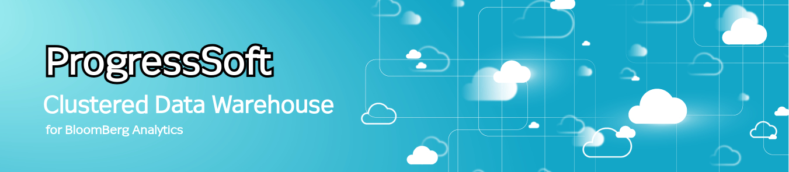
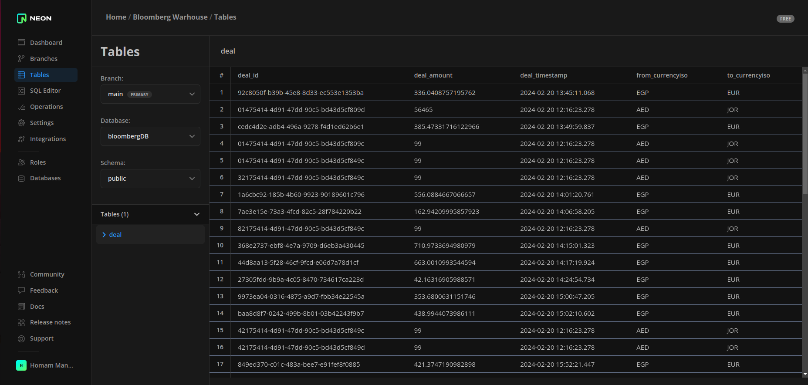
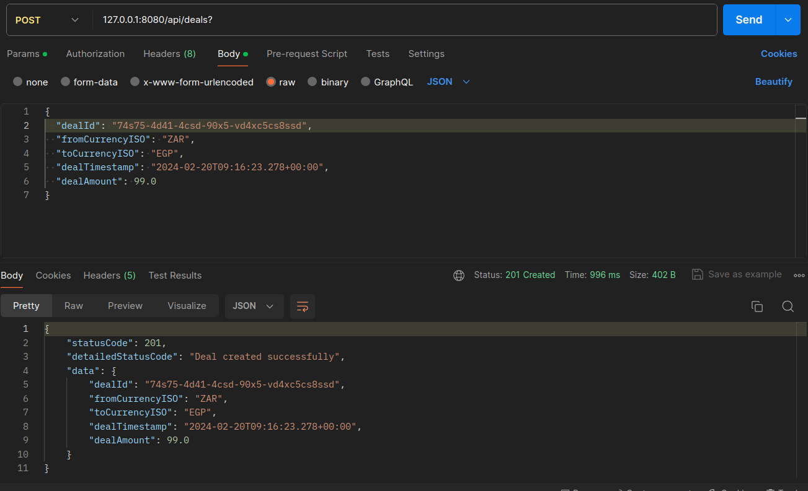
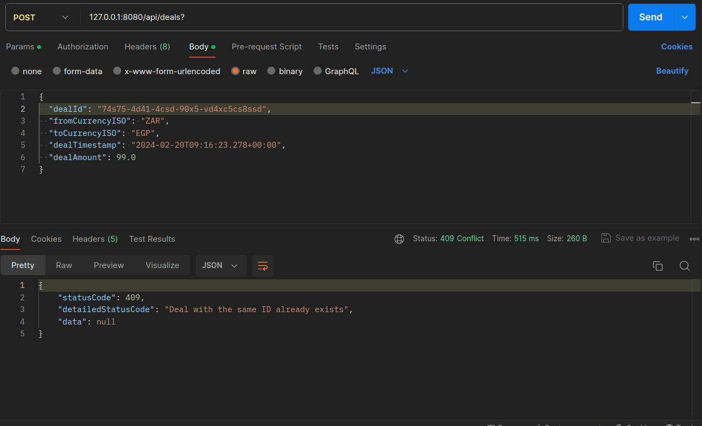
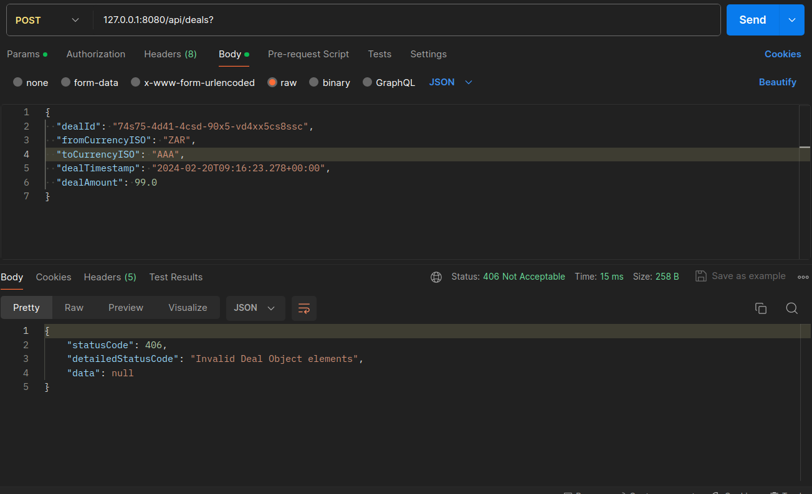

# Bloomberg Clustered Data Warehouse


## Description

This project is a data warehouse system developed to mimic Bloomberg warehouse for analyzing FX deals.

The system accepts deal details from external sources and persists them into a PostgreSQL database. It ensures data
integrity by validating the row structure, preventing duplicate imports, and saving each imported row into the database
without rollback.

The system offers various APIs for inserting & fetching FX deals into the warehouse database.

---

## Table of Contents

- [Installation](#installation)
- [Endpoints](#endpoints)
- [PostgreSQL DataBase](#postgresql-database)
- [Error Handling](#error-handling)
- [Logging](#logging)
- [Unit Testing](#unit-testing)
- [Integration Testing](#integration-testing)
- [Technologies Used](#technologies-used)


---

## Installation

To run this project locally, follow these steps:

### Run with Docker Compose (Recommended)

1. Clone this repository to your local machine using the following command:

```bash
git clone https://github.com/homeo26/bloomberg-data-warehouse-progresssoft.git
```

2. Ensure docker & Docker-compose installed on your system.
3. Navigate to the project directory:

```bash
# Usually it can be found in Downloads
cd <pathTo/bloomberg>
```

4. Run docker compose and the system must run:

```bash
docker-compose up --build
```

5.To turn of the Docker container run the docker compose down:

```bash
docker compose down  
```

### Run with Maven

1. Navigate to the project directory:

```bash
# Usually it can be found in Downloads
cd <pathTo/bloomberg>
```

2. Build the project using Maven:

```bash
mvn clean install
```

3.Run the Spring Boot application:

```bash
java -jar target/bloomberg-app.jar
```

---

## Endpoints

### Insert Deal

- **Endpoint**: `/api/deals`
- **Method**: POST
- **Description**: Insert a new deal into the system.
- **Request Body**: JSON representation of the Deal object.
- **Response**: Custom response containing details about the operation.

### Fetch Deals List

- **Endpoint**: `/api/deals`
- **Method**: GET
- **Description**: Fetch a list of all deals from the system.
- **Response**: Custom response containing the fetched deals.

### Upload CSV File

- **Endpoint**: `/api/upload`
- **Method**: POST
- **Description**: Upload a CSV file containing deal data to insert into the system.
- **Request Body**: Multipart form data with the CSV file.
- **Response**: Custom response containing details about the operation.

---

## PostgreSQL DataBase

* The system database is 24/7 active.
* The system postgreSQL database were created and processed on neon platform
* Refer neon for more info [neon.tech](https://neon.tech/)
* The database contains Deal table as the following:



* The database insertion and fetching were processed by Spring JPA to maintain SQL injection cases.

[note] the above screenshot contains testing data.


---

## Error Handling

The application handles errors and exceptions gracefully, providing meaningful error messages and appropriate HTTP
status codes in the responses.

* The app & APIs don't terminate in case of invalid requests.

### Covered Cases

The system insures robust and consistent entries many cases such as and returns meaningful responses based on each case:

* No deals are duplicated *(no deals with same dealID)*
* No deals entered with `NULL` values in any field.
* No deals entered with amount <= 0
* No deals entered with invalid ISO Currencies (form & to);
* No deals entered with invalid Timestamp
* and more!

Take those test cases for reference:
* Valid deal insertion successfully:

* Preventing same deal insertion twice:

* Preventing corrupted/invalid ISO currency:

* Preventing invalid money amount:

* FX deals were initially founded in the 1982, So we must prevent invalid time before 1982:


---

## Logging

The application utilizes **SLF4J** for logging, ensuring proper logging of events and errors.
* Refer SL4J official website for more info [SL4J.org](https://www.slf4j.org/)

---

## Unit Testing

The application includes comprehensive unit tests covering all critical components, ensuring high test coverage and
reliability.

* Added `test-data` directory containing test data easing testing.
* More tests scenarios will be added to cover all edge cases.

---

## Integration Testing

* **TPA**

---

## Technologies Used

- Java 21
- Spring Boot
- Spring Data
- Spring JPA
- PostgreSQL data base
- Docker
- Maven
- JUnit
- SLF4J

---

* **Author:** *Homam Manasra*

* **Dev env**: Ubuntu 23.10

Special thanks for ProgressSoft
